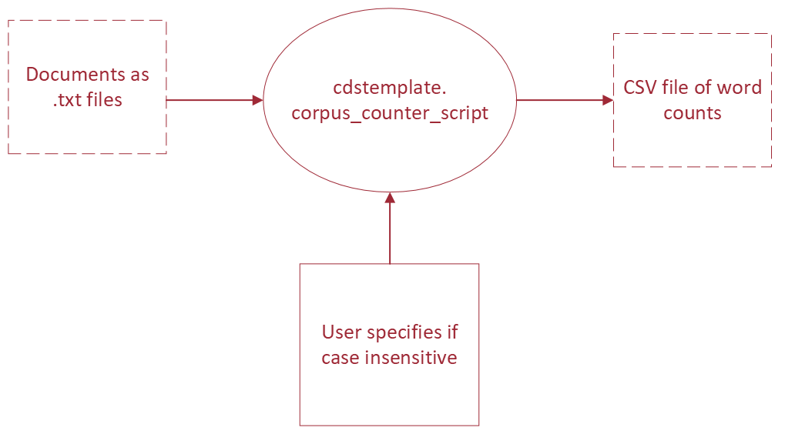

# Media Cloud Query + Model toolkit

## Table of Contents

- [Overview](#overview)
- [Getting Started](#getting-started)
  - [Installing Dependencies and Packages](#installing-dependencies-and-packages)
- [Usage Guide](#usage-guide)
  - [BERT Text Classification](#bert-text-classification)
  - [Data Preparation](#data-preparation)
  - [Basic Training](#basic-training-no-hyperparameter-optimization)
  - [Hyperparameter Optimization with Optuna](#hyperparameter-optimization-with-optuna)
- [Data Dependencies Tools](#data-dependencies-tools)
- [A Note on Notebooks](#a-note-on-notebooks)

# Overview
Sets up a pipeline that takes a user query, retrieves relevant full-text media articles from [Media Cloud](https://www.mediacloud.org), imports it into a user defined Label Studio project, and produces both an annotated dataset and a trained classifier model. Designed for Media Cloud engineers and communication researchers, the pipeline simplifies the end-to-end process of sourcing, labeling, and modeling media content. It eliminates the need for repetitive, manual setup and enables more targeted analysis through iterative query refinement. By improving the initial keyword matching, the pipeline supports more nuanced exploration of patterns in media coverage that are difficult to capture through traditional search alone.

# Getting Started
## Installing Dependencies and Packages
Use these steps for setting up a development environment to install and work with code in this template:
1) Set up a Python 3 virtual environment using [Conda](https://docs.conda.io/projects/conda/en/latest/user-guide/install/index.html#) or [Virtualenv](https://virtualenv.pypa.io/en/latest/index.html). Read [Python Virtual Environments: A Primer](https://realpython.com/python-virtual-environments-a-primer/#the-virtualenv-project) for details on how to get started with virtual environments and why you need them. For a _really detailed_ explanation, see [An unbiased evaluation of environment management and packaging tools](https://alpopkes.com/posts/python/packaging_tools/). 
2) Activate your virtual environment.

3) Install the package.
  - If you want to just use the scripts and package features, install the project by running `pip install .` from the root directory.
  <!-- - If you will be changing the code and running tests, you can install it by running `pip install -e .[test,dev]`. The `-e/--editable` flag means local changes to the project code will always be available with the package is imported. You wouldn't use this in production, but it's useful for development.
  - Note for zsh users: use `pip install -e .'[test,dev]'` -->

### Environment Variables

To use the document retriever script, you must set the `MC_API_KEY` environment variable. To use the label studio uploader script, you must set `LABEL_STUDIO_HOST` and `LABEL_STUDIO_TOKEN` environment variables. Both scripts uses the `python-dotenv` library, so you can create a `.env` file in the project's root directory:

```
MC_API_KEY="YOUR_MEDIA_CLOUD_API_KEY_HERE"
LABEL_STUDIO_HOST="YOUR_LABEL_STUDIO_HOST_HERE"
LABEL_STUDIO_TOKEN="YOUR_LABEL_STUDIO_TOKEN_HERE"
```

The script will automatically load this variable.


For example, if you use Conda, you would run the following to create an environment named `template` with python version 3.10, then activate it and install the package in developer mode:
```
$ conda create -n template python=3.10 -y
Collecting package metadata (current_repodata.json): done
Solving environment: done

## Package Plan ##

  environment location: /home/virginia/miniconda3/envs/template

  added / updated specs:
    - python=3.10


The following NEW packages will be INSTALLED:

    package                    |            build
    ---------------------------|-----------------
...

$ conda activate `template`
$ pip install -e .[test,dev]
Obtaining file:///home/virginia/workspace/PythonProjectTemplate
  Installing build dependencies ... done
  Getting requirements to build wheel ... done
  Installing backend dependencies ... done
    Preparing wheel metadata ... done
Collecting numpy
...
```

## Specifying Requirements
In order for users to install your package and all the libraries it depends on by running `pip install`, you need to provide a `pyproject.toml` file. This has two important sections:
- `project`: List project metadata and version information and all library requirements/dependencies, including for testing or development environments. This is the main file you will work with and add requirements to. Some dependencies 
- `build-system`: Define the build tool that is used to package and distribute your code. For this project, we use [SetupTools](https://setuptools.pypa.io/en/latest/userguide/quickstart.html).

If you'd like to learn more about python packaging, refer to [the Python Packaging User Guide](https://packaging.python.org/en/latest/) or [PEP 517](https://peps.python.org/pep-0517/#build-requirements).

### Requirements via conda environment files
[Anaconda](https://www.anaconda.com/download/) and its bare bones counterpart, [Miniconda](https://docs.anaconda.com/free/miniconda/index.html), are especially useful if your project depends on libraries that are difficult to install in the standard pythonic way, such as [GPU libraries](https://docs.anaconda.com/free/working-with-conda/packages/gpu-packages/). If this is the case, you should also share a [Conda environment file](https://docs.conda.io/projects/conda/en/latest/user-guide/tasks/manage-environments.html#creating-an-environment-file-manually) with your code. The conda virtual environment will need to be created and activated before any `pip install` steps. Installations with conda dependencies are usually a little more complicated, so make sure you include step-by-step instructions in documentation. 

### Containerized applications
In cases when its important that your software work exactly the same on every operating system or you want to abstract away difficult installation steps for end user, you can consider creating a [Docker container](https://www.docker.com/resources/what-container/). This is often appropriate deploying services in the cloud or providing an application for a tech-savvy person to use on their own. However, it's not necessary for most of our projects. 


## Directory Structure
So what does each file in this repository do?
```
.
├── src/                                 # Source code root
│   └── mc_classifier_pipeline/           # Main Python package
│       ├── __init__.py                   # Package marker
│       ├── doc_retriever.py              # Retrieves documents from Media Cloud
│       ├── label_studio_uploader.py      # Uploads data to Label Studio
│       ├── run_pipeline.py               # Main pipeline runner script
│       └── utils.py                      # Utility functions (logging, helpers, etc.)
├── CHANGELOG.md                         # Project version history and changes
├── CONTRIBUTIONS.md                     # Contribution guidelines
├── Dockerfile                           # Docker build instructions for containerization
├── docker-compose.yml                   # Multi-container Docker orchestration
├── LICENSE.md                           # License for project usage
├── pyproject.toml                       # Project metadata, dependencies, and build tools
├── README.md                            # Project overview and documentation (this file)
├── data/                                # Data files (not tracked by git)
│   ├── SoJosources.csv                  # Example/source data file
├── docs/                                # Sphinx documentation source
│   ├── conf.py                          # Sphinx configuration
│   ├── index.rst                        # Sphinx documentation index
│   ├── make.bat                         # Windows build script for docs
│   └── Makefile                         # Unix build script for docs
├── notebooks/                           # Jupyter notebooks for exploration
│   └── exploration.ipynb                # Example exploratory notebook
├── tests/                               # Unit and integration tests
│   └── test_dummy.py                    # Example test file
├── .github/                             # GitHub configuration
│   └── workflows/
│       └── python_package.yml           # GitHub Actions workflow for CI/testing
├── .gitignore                           # Files and folders ignored by git
```


# Communication Tools and Code
When you work with others, it's not just about the code!

The README, CHANGELOG and docstrings are just as important.

- _README.md_ : Summarize the project's purpose and give installation instructions.
- _CHANGELOG.md_ : Tell the user what has changed between versions and why, see [Keep A CHANGELOG](https://keepachangelog.com/en/1.0.0/)
- docstrings: Appear directly in your code and give an overview of each function or object. They can be printed using `help(object)` from the python interpreter or used to automatically generate API documentation with a tool like [Sphinx](https://www.sphinx-doc.org/en/master/index.html). There are many different docstring formats. Your team can choose any they like, just be consistent. This template uses [reStructuredText style](https://peps.python.org/pep-0287/).
- Sphinx  : Create html documentation for your functions based on the docstrings you write in the code. Use [Sphinx](https://www.sphinx-doc.org/en/master/index.html) to streamline the documentation process.

Read [Real Python's Documenting Python Code: A Complete Guide](https://realpython.com/documenting-python-code/) for more ideas about effectively documenting code. The `.md` files are written using [Markdown](https://www.markdownguide.org/), a handy formatting language that is automatically rendered in Github.

# Tests
Although it's [impossible to generally prove that your code is bug-free](https://en.wikipedia.org/wiki/Undecidable_problem), automated testing is a valuable tool. It provides:
- Proof that your code works as intended in most common examples and important edge cases
- Instant feedback on whether changes to the code broke its functionality
- Examples of how to use the code, a type of documentation

This repository has tests configured using [pytest](https://pytest.org/) and the Github action defined in `.github/workflows/python_package.yml` will run tests every time you make a pull request to the main branch of the repository. [Unittest](https://docs.python.org/3/library/unittest.html#module-unittest) and [nose2](https://docs.nose2.io/en/latest/) are other common test frameworks for python.

You can run tests locally using `pytest` or `python -m pytest` from the command line from the root of the repository or configure them to be [run with a debugger in your IDE](https://code.visualstudio.com/docs/python/testing). For example:
```
$ pytest
======================== test session starts ========================
platform linux -- Python 3.10.4, pytest-7.1.2, pluggy-1.0.0
rootdir: /home/virginia/workspace/PythonProjectTemplate
collected 2 items

tests/test_sample_module.py .
```

Read the following articles for tips on writing your own tests:
- [Getting Started With Testing in Python](https://realpython.com/python-testing/)
- [13 Tips for Writing Useful Unit Tests](https://betterprogramming.pub/13-tips-for-writing-useful-unit-tests-ca20706b5368)
- [Why Good Developers Write Bad Unit Tests](https://mtlynch.io/good-developers-bad-tests)

# Reproducible Experiments
In practice, data science often relies on pipelining many operations together to prepare data, extract features, then train and evaluate models or produce analysis. Whether someone can reproduce your experiments depends on how clearly you lay out the pipeline and parameters that you use for each 'node' in the pipeline, including stating where to find the input data and how it should be formatted.

In practice, you should write scripts that are flexible enough to change the parameters you'd like to experiment with and define the pipeline using a directed acyclic graph (DAG), where the outputs from earlier steps become the dependencies for later ones. It's good practice to draw out the DAG for your experiment first, noting inputs, outputs and parameters, before you code scripts for the pipeline, like this:



<!-- ## Reusable Scripts
Our 'experiment' here is simply counting the occurrence of words from a set of documents, in the form of text files, then writing the counts of each word to a CSV file. This operation is made available to users via the `mc_classifier_pipeline.corpus_counter_script` and by using the [`argparse` command-line parsing library](https://docs.python.org/3/library/argparse.html#module-argparse), we clearly describe the expected input parameters and options, which can be displayed using the `--help` flag. There are [other command-line parsers](https://realpython.com/comparing-python-command-line-parsing-libraries-argparse-docopt-click/) you can use, but `argparse` comes with python, so you don't need to add an extra requirement.


Since we have made the package installable and defined it as the `corpus-counter` script in `project.toml`, users can run it using `corpus-counter`, `python -m mc_classifier_pipeline.corpus_counter_script` or `python src/mc_classifier_pipeline/corpus_counter_script.py`, but all work the same way:
```
$ corpus-counter --help 
usage: corpus-counter [-h] [--case-insensitive] csv documents [documents ...]

A script to generate counts of tokens in a corpus

positional arguments:
  csv                   Path to the output CSV storing token counts. Required.
  documents             Paths to at least one raw text document that make up the corpus. Required.

options:
  -h, --help            show this help message and exit
  --case-insensitive, -c
                        Default is to have case sensitive tokenization. Use this flag to make the token counting
                        case insensitive. Optional.
$ python src/mc_classifier_pipeline/corpus_counter_script.py --help
usage: corpus_counter_script.py [-h] [--case-insensitive]
...
$ python -m mc_classifier_pipeline.corpus_counter_script --help
usage: corpus_counter_script.py [-h] [--case-insensitive]
                                csv documents [documents ...]

A script to generate counts of tokens in a corpus
...
```

Using the help message, we can understand how to run the script to count all the words in the text files in `data/gutenberg` in a case-insensitive way, saving word counts to a new csv file, `data/gutenberg_counts.csv`:
```
$ corpus-counter data/gutenberg_counts.csv data/gutenberg/*.txt --case-insensitive
INFO : 2023-12-08 12:26:10,770 : mc_classifier_pipeline.corpus_counter_script : Command line arguments: Namespace(csv='data/gutenberg_counts.csv', documents=['data/gutenberg/austen-emma.txt', 'data/gutenberg/austen-persuasion.txt', 'data/gutenberg/austen-sense.txt', 'data/gutenberg/bible-kjv.txt', 'data/gutenberg/blake-poems.txt', 'data/gutenberg/bryant-stories.txt', 'data/gutenberg/burgess-busterbrown.txt', 'data/gutenberg/carroll-alice.txt', 'data/gutenberg/chesterton-ball.txt', 'data/gutenberg/chesterton-brown.txt', 'data/gutenberg/chesterton-thursday.txt'], case_insensitive=True)
DEBUG : 2023-12-08 12:26:10,771 : mc_classifier_pipeline.word_count : CorpusCounter instantiated, tokenization pattern: \s, case insensitive: True
INFO : 2023-12-08 12:26:10,771 : mc_classifier_pipeline.corpus_counter_script : Tokenizing document number 0: data/gutenberg/austen-emma.txt
DEBUG : 2023-12-08 12:26:10,771 : mc_classifier_pipeline.word_count : Tokenizing '[Emma by Jane Austen 1816]
...
```
 -->

## Usage Guide

## BERT Text Classification

The pipeline includes a BERT-based text classifier with support for hyperparameter optimization using Optuna. Below are examples of how to use the classifier for different scenarios.

**Requirements:** The hyperparameter optimization functionality requires Optuna, which is included in the project dependencies. If you installed the package using `pip install .`, Optuna should already be available.

### Data Preparation

Your data should be in CSV format with the following structure:
- Training data: `train.csv` 
- Test data: `test.csv`

Both files should contain at minimum:
- A text column (default name: `text`)
- A label column (default name: `label`)

Example data structure:
```csv
text,label
"This movie was amazing!",positive
"I didn't like this film.",negative
```

### Basic Training (No Hyperparameter Optimization)

```python
from mc_classifier_pipeline.bert_recipe import BERTTextClassifier

# Initialize classifier
classifier = BERTTextClassifier(model_name="bert-base-uncased")

# Train the model
metadata = classifier.train(
    project_folder="path/to/data",  # Folder containing train.csv and test.csv
    save_path="path/to/save/model", # Where to save the trained model
    text_column="text",             # Name of text column (optional)
    label_column="label"            # Name of label column (optional)
)

print("Training completed!")
print(f"Final evaluation results: {metadata['final_eval_results']}")
```

### Hyperparameter Optimization with Optuna

#### Method 1: Enable optimization during initialization

```python
from mc_classifier_pipeline.bert_recipe import BERTTextClassifier

# Initialize classifier with Optuna optimization enabled
classifier = BERTTextClassifier(
    model_name="bert-base-uncased",
    use_optuna=True
)

# Train with optimization (will automatically run Optuna)
metadata = classifier.train(
    project_folder="path/to/data",
    save_path="path/to/save/optimized_model",
    n_trials=20,                    # Number of optimization trials
    timeout=3600                    # Optional timeout in seconds
)

print(f"Best F1 score: {metadata['optuna_optimization']['best_f1_score']}")
print(f"Best parameters: {metadata['optuna_optimization']['best_parameters']}")
```

#### Method 2: Enable optimization during training

```python
from mc_classifier_pipeline.bert_recipe import BERTTextClassifier

# Initialize classifier normally
classifier = BERTTextClassifier(model_name="bert-base-uncased")

# Train with optimization enabled
metadata = classifier.train(
    project_folder="path/to/data",
    save_path="path/to/save/optimized_model",
    optimize_hyperparams=True,      # Enable optimization for this training
    n_trials=15,                    # Number of trials to run
    timeout=7200                    # 2 hour timeout
)
```

#### Method 3: Run optimization separately

```python
from mc_classifier_pipeline.bert_recipe import BERTTextClassifier

# Initialize classifier
classifier = BERTTextClassifier(model_name="bert-base-uncased")

# Run hyperparameter optimization only
study = classifier.optimize_hyperparameters(
    project_folder="path/to/data",
    n_trials=25,
    timeout=1800,                   # 30 minute timeout
    save_path="path/to/save/study"  # Where to save optimization results
)

print(f"Best parameters found: {study.best_params}")
print(f"Best F1 score: {study.best_value}")

# Then train with the best parameters
best_params = study.best_params
metadata = classifier.train(
    project_folder="path/to/data",
    save_path="path/to/save/final_model",
    hyperparams={
        "learning_rate": best_params["learning_rate"],
        "per_device_train_batch_size": best_params["batch_size"],
        "num_train_epochs": best_params["num_epochs"],
        "weight_decay": best_params["weight_decay"],
        "max_length": best_params["max_length"]
    }
)
```

### Hyperparameter Search Space

The Optuna optimization searches over the following hyperparameters:

| Parameter | Type | Range | Description |
|-----------|------|-------|-------------|
| `learning_rate` | Float | 1e-5 to 5e-5 (log scale) | Learning rate for optimizer |
| `batch_size` | Categorical | [8, 16, 32] | Training batch size |
| `num_epochs` | Integer | 1 to 4 | Number of training epochs |
| `weight_decay` | Float | 0.0 to 0.1 | L2 regularization strength |
| `warmup_ratio` | Float | 0.0 to 0.2 | Fraction of steps for learning rate warmup |
| `max_length` | Categorical | [256, 512] | Maximum sequence length |

### Study Persistence and Resumption

The optimization study is automatically saved and can be resumed:

**Study Save Locations:**
- During optimization: `{save_path}/optuna_study.pkl` or `{project_folder}/optuna_study.pkl`
- With trained model: Study is preserved alongside the model for future analysis

**Resuming Optimization:**
```python
# If a study exists, it will automatically resume
classifier = BERTTextClassifier(model_name="bert-base-uncased")
study = classifier.optimize_hyperparameters(
    project_folder="path/to/data",
    save_path="path/with/existing/study",  # Contains optuna_study.pkl
    n_trials=10  # Will continue from where it left off
)
```

# Data Dependencies Tools
[Build automation tools](https://en.wikipedia.org/wiki/Build_automation) like [Make](https://en.wikipedia.org/wiki/Make_(software)) have been used to resolve dependencies and compile software since the 1970s. Build automation can also be used in data science and machine learning workflows for [many of the same reasons](https://en.wikipedia.org/wiki/Build_automation#Advantages), like eliminating redundant tasks, maintaining history and improved quality and consistency through automating processes. Using a build tool can also be a documentation and communication tool, since it declares the most common ways to run code and reproduce experiments.

In the Machine Learning Operations (MLOps) community these automation tools are often called [task or workflow orchestration](https://www.datarevenue.com/en-blog/airflow-vs-luigi-vs-argo-vs-mlflow-vs-kubeflow). There are many options, such as [Airflow](https://airflow.apache.org/), [Luigi](https://github.com/spotify/luigi), [MLflow](https://mlflow.org/), [Kubeflow](https://www.kubeflow.org/), all with various additional features for versioning experiments, scheduling and visualizations, but at the core they are all built on the same dependency graph principle as the OG [Make](https://opensource.com/article/18/8/what-how-makefile).

Some of these tools can take a lot of work to set up, so discuss the trade-offs with your team to decide what you'd like to use. In the early stages of a project, we recommend using something easy to set up, like [Make](https://opensource.com/article/18/8/what-how-makefile).
## A Note on Notebooks
We have also included an example Jupyter notebook

Jupyter notebooks are useful tools for exploratory data analysis, prototyping baseline models and creating visualizations. However, they are _not_ an acceptable way to hand-off code for others to reproduce. Have you ever tried to run someone else's notebook, only to find out a cell was deleted, and you have no idea what it was supposed to do?

[Don't put data science notebooks into production](https://martinfowler.com/articles/productize-data-sci-notebooks.html), they are [hard to test, version, parametrize and keep track of state](https://www.reddit.com/r/datascience/comments/ezh50g/jupyter_notebooks_in_productionno_just_no/).

There _are_ [companies that use notebooks in production architecture](https://blog.goodaudience.com/inside-netflixs-notebook-driven-architecture-aedded32145e), but they have entire Devops organizations to help configure deployment and _still_ use workflow tools like [papermill](https://papermill.readthedocs.io/en/latest/) and Airflow to parametrize notebook dependencies. Unless you are willing to put in the effort to parametrize your notebooks in pipeline workflows, don't use them when stability and reproducibility matter.

Best practices for working with notebooks are changing as they become more popular. However, for now most of these services are too expensive for our partners or difficult to configure. You can use a notebook for prototyping and exploratory analysis, but once the project moves forward, use [`nbconvert`](https://linuxhint.com/convert-jupyter-notebook-python/) to convert the notebook to python code, then add some tests!