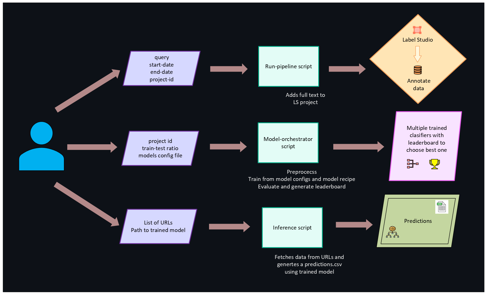
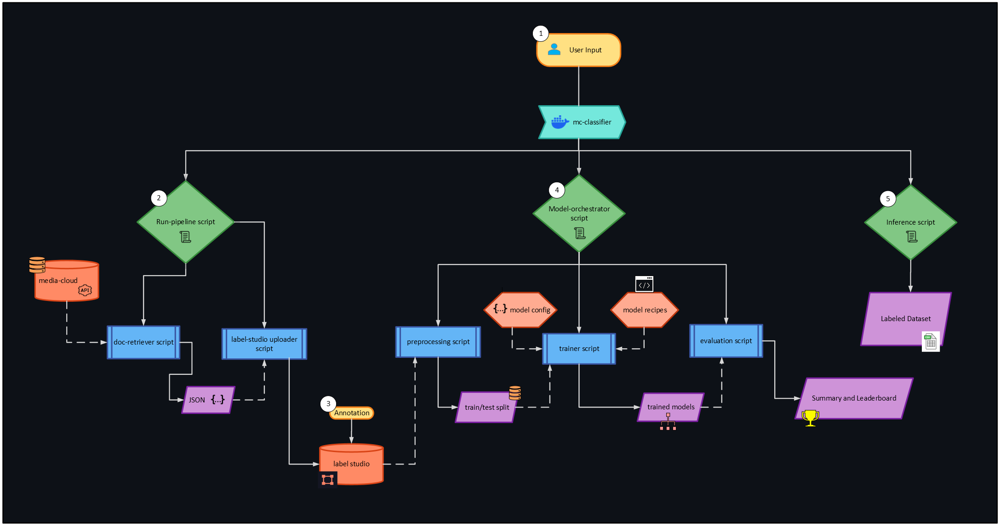

# Media Cloud Query + Model toolkit

## Table of Contents

- [Overview](#overview)
  - [System Diagram](#system-diagram)
  - [Directory Structure](#directory-structure)
- [Getting Started](#getting-started)
  - [Installing Dependencies and Packages](#installing-dependencies-and-packages)
  - [Environment Variables](#environment-variables)
- [Running the Scripts]

# Overview
Sets up 2 pipelines that:
1. takes a user query, retrieves relevant full-text media articles from [Media Cloud](https://www.mediacloud.org), imports it into a user defined Label Studio project
2. produces both an annotated dataset and a trained classifier model
It also uses the trained model to make predictions on a list of URLs. 
Designed for Media Cloud engineers and communication researchers, the pipeline simplifies the end-to-end process of sourcing, labeling, and modeling media content. It eliminates the need for repetitive, manual setup and enables more targeted analysis through iterative query refinement. By improving the initial keyword matching, the pipeline supports more nuanced exploration of patterns in media coverage that are difficult to capture through traditional search alone.

## System Diagram




## Directory Structure
So what does each file in this repository do?
```
├── src/                                 # Source code root
│   └── mc_classifier_pipeline/           # Main Python package
│       ├── __init__.py                   # Package marker
        ├── bert_recipe.py                # BERT model recipe
│       ├── doc_retriever.py              # Retrieves documents from Media Cloud
        ├── evaluation.py                 # Evaluates models and generates metrics summary with leaderboard
        ├── inference.py                  # Generates predictions for a list of story URLs using a trained model
│       ├── label_studio_uploader.py      # Uploads data to Label Studio
        ├── model_orchestrator.py         # Connects preprocessing, training, and evaluation
        ├── preprocessing.py              # Preprocesses data uploaded to labelstudio
│       ├── run_pipeline.py               # Connects document retrieval and labelstudio uploader
        ├── sk_naive_bayes_recipe.py      # Naive Bayes Model Recipe
        ├── trainer.py                    # Trains models from config
│       └── utils.py                      # Utility functions (logging, helpers, etc.)
├── configs/                                                      # Contains model configs required for orchestrator
    ├── quick_test.json                                             # Example config file
    ├── README.md                                                   # Documentation to write configs
├── data/                                                         # Stores data retrieved from Media Cloud
    ├── raw_articles/                                               # Full-text from Media Cloud Query
    ├── .gitignore                                                  # Data files and folders ignored by git
    ├── SoJosources.csv                                             # Example/source data for the notebook
├── docs/                                                         # Sphinx documentation source
│   ├── conf.py                                                     # Sphinx configuration
│   ├── index.rst                                                   # Sphinx documentation index
│   ├── make.bat                                                    # Windows build script for docs
│   └── Makefile                                                    # Unix build script for docs
├──experiments/project_{project_id}/{experiment timestamp}/       # Generated from running model_orchestrator
├── train.csv                                                       # Training data
├── test.csv                                                        # Test data
├── metadata.json                                                   # Metadata from preprocessing
└── models/                                               
    ├── training_summary.json                                       # Training metadata 
    ├── {YYYYMMDD_HHMMSS_000}/                                      # Timestamped name
    │   ├── metadata.json                                           # Model-specific metadata
    │   ├── label_encoder.pkl                                       # Pickled label encoder file
    │   ├── (HF) config.json, pytorch_model.bin, tokenizer.*        # Pickled model files
    │   └── (sklearn) model.pkl, vectorizer.pkl                     # Pickled model files
    ├── results.csv                                                 # Leaderboard
    └── evaluation_summary.json                                     # More details about models on leaderboard
├── notebooks/                           # Stores data retrieved from Media Cloud
    ├── exploration.py                   # Contains EDA and Media Cloud API usage examples
├── tests/                               # Unit and integration tests
│   └── test_dummy.py                    # Example test file
├── .dockerignore
├── .gitignore
├── CHANGELOG.md                         # Project version history and changes
├── CONTRIBUTIONS.md                     # Contribution guidelines
├── docker-compose.yml                   # Multi-container Docker orchestration
├── Dockerfile                           # Docker build instructions for containerization
├── LICENSE.md                           # License for project usage
├── pyproject.toml                       # Project metadata, dependencies, and build tools
├── README.md                            # Project overview and documentation (this file)
├── data/                                # Data files (not tracked by git)
│   ├── SoJosources.csv                  # Example/source data file
├── notebooks/                           # Jupyter notebooks for exploration
│   └── exploration.ipynb                # Example exploratory notebook
├── .github/                             # GitHub configuration
│   └── workflows/
│       └── python_package.yml           # GitHub Actions workflow for CI/testing
├── .gitignore                           # Files and folders ignored by git
```

# Getting Started
## Installing Dependencies and Packages
Use these steps for setting up a development environment to install and work with code in this template:
1) Set up a Python 3 virtual environment using [Conda](https://docs.conda.io/projects/conda/en/latest/user-guide/install/index.html#) or [Virtualenv](https://virtualenv.pypa.io/en/latest/index.html). Read [Python Virtual Environments: A Primer](https://realpython.com/python-virtual-environments-a-primer/#the-virtualenv-project) for details on how to get started with virtual environments and why you need them. For a _really detailed_ explanation, see [An unbiased evaluation of environment management and packaging tools](https://alpopkes.com/posts/python/packaging_tools/). 
2) Activate your virtual environment.

3) Install the package.
  - If you want to just use the scripts and package features, install the project by running `pip install .` from the root directory.
  <!-- - If you will be changing the code and running tests, you can install it by running `pip install -e .[test,dev]`. The `-e/--editable` flag means local changes to the project code will always be available with the package is imported. You wouldn't use this in production, but it's useful for development.
  - Note for zsh users: use `pip install -e .'[test,dev]'` -->

## Environment Variables

To use the document retriever script, you must set the `MC_API_KEY` environment variable. To use the label studio uploader script, you must set `LABEL_STUDIO_HOST` and `LABEL_STUDIO_TOKEN` environment variables. Both scripts uses the `python-dotenv` library, so you can create a `.env` file in the project's root directory:

```
MC_API_KEY="YOUR_MEDIA_CLOUD_API_KEY_HERE"
LABEL_STUDIO_HOST="YOUR_LABEL_STUDIO_HOST_HERE"
LABEL_STUDIO_TOKEN="YOUR_LABEL_STUDIO_TOKEN_HERE"
```

The script will automatically load this variable.


For example, if you use Conda, you would run the following to create an environment named `template` with python version 3.10, then activate it and install the package in developer mode:
```
$ conda create -n template python=3.10 -y
Collecting package metadata (current_repodata.json): done
Solving environment: done

## Package Plan ##

  environment location: /home/virginia/miniconda3/envs/template

  added / updated specs:
    - python=3.10


The following NEW packages will be INSTALLED:

    package                    |            build
    ---------------------------|-----------------
...

$ conda activate `template`
$ pip install -e .[test,dev]
Obtaining file:///home/virginia/workspace/PythonProjectTemplate
  Installing build dependencies ... done
  Getting requirements to build wheel ... done
  Installing backend dependencies ... done
    Preparing wheel metadata ... done
Collecting numpy
...
```

# Running the Scripts

The pipeline consists of several key scripts that can be run independently or as part of the full workflow.

# Full Workflow

## 1. Document Retrieval and Label Studio Upload

To retrieve documents from Media Cloud and upload them to Label Studio:

```bash
python -m mc_classifier_pipeline.run_pipeline \
 --query "your search query" \
 --project-id YOUR_PROJECT_ID \
 --start-date YYYY-MM-DD \
 --end-date YYYY-MM-DD
```

### Example

```bash
python -m mc_classifier_pipeline.run_pipeline \
 --query "climate change AND (protest OR activist)" \
 --project-id 123 \
 --start-date 2023-01-01 \
 --end-date 2023-12-31
```

### Parameters

| Parameter | Description |
|-----------|-------------|
| `--query` | Search terms with boolean operators (AND, OR) |
| `--project-id` | Label Studio project identifier |
| `--start-date` | Start date for document retrieval (YYYY-MM-DD format) |
| `--end-date` | End date for document retrieval (YYYY-MM-DD format) |

## 2. Model Training and Orchestration

To train and run classification models using the Model Orchestrator:

```bash
python -m mc_classifier_pipeline.model_orchestrator \
 --project-id YOUR_PROJECT_ID \
 --train-ratio TRAIN_SPLIT_RATIO \
 --output-dir OUTPUT_DIRECTORY \
 --target-label 'LABEL_NAME' \
 --models-config CONFIG_FILE_PATH
```

### Examples

**Basic model training:**
```bash
python -m mc_classifier_pipeline.model_orchestrator \
 --project-id 1 \
 --train-ratio 0.7 \
 --output-dir experiments \
 --target-label 'Analysis' \
 --models-config configs/quick_test.json
```

**Resume from existing experiment:**
```bash
python -m mc_classifier_pipeline.model_orchestrator \
 --experiment-dir src/mc_classifier_pipeline/experiments/project_1/20250811_092812 \
 --target-label 'Analysis' \
 --models-config configs/quick_test.json
```

**Custom experiment with specific settings:**
```bash
python -m mc_classifier_pipeline.model_orchestrator \
 --project-id 10 \
 --train-ratio 0.8 \
 --output-dir experiments \
 --experiment-name climate_sentiment_v1 \
 --random-seed 123 \
 --models-config configs/quick_test.json
```

### Parameters

| Parameter | Description |
|-----------|-------------|
| `--project-id` | Label Studio project ID containing labeled data |
| `--train-ratio` | Proportion of data for training (e.g., 0.7 = 70% train, 30% test) |
| `--output-dir` | Directory to save experiment results |
| `--target-label` | Name of the label to predict |
| `--models-config` | JSON configuration file specifying models to train |
| `--experiment-dir` | Path to existing experiment (for resuming/rerunning) |
| `--experiment-name` | Custom name for the experiment |
| `--random-seed` | Seed for reproducible results |

## 3. Inference Pipeline

Run inference on articles from URLs using trained models:

```bash
python -m src.mc_classifier_pipeline.inference \
 --url-file URL_LIST_FILE \
 --model-dir MODEL_DIRECTORY
```

### Examples

**Basic usage:**
```bash
python -m src.mc_classifier_pipeline.inference \
 --url-file url_list.txt \
 --model-dir experiments/project_1/20250806_103847/models/20250806_123513_000
```

**With custom parameters:**
```bash
python -m src.mc_classifier_pipeline.inference \
 --url-file my_urls.txt \
 --model-dir models/bert_model \
 --output-file my_predictions.csv \
 --batch-size 16 \
 --start-date 2025-01-01 \
 --end-date 2025-06-01
```

### Parameters

| Parameter | Description |
|-----------|-------------|
| `--url-file` | Text file containing URLs to process (one per line) |
| `--model-dir` | Directory containing trained model files |
| `--output-file` | Output CSV file for predictions (optional) |
| `--batch-size` | Number of articles to process in each batch (optional) |
| `--start-date` | Filter articles by start date (YYYY-MM-DD format, optional) |
| `--end-date` | Filter articles by end date (YYYY-MM-DD format, optional) |

# Individual Scripts

## Additional Tools

### Query Keyword Expansion
To expand your search query with related terms:
```bash
python -m mc_classifier_pipeline.query_keyword_expander \
    --query "your initial query" \
    --num-keywords 10
```


# Communication Tools and Code
When you work with others, it's not just about the code!

The README, CHANGELOG and docstrings are just as important.

- _README.md_ : Summarize the project's purpose and give installation instructions.
- _CHANGELOG.md_ : Tell the user what has changed between versions and why, see [Keep A CHANGELOG](https://keepachangelog.com/en/1.0.0/)
- docstrings: Appear directly in your code and give an overview of each function or object. They can be printed using `help(object)` from the python interpreter or used to automatically generate API documentation with a tool like [Sphinx](https://www.sphinx-doc.org/en/master/index.html). There are many different docstring formats. Your team can choose any they like, just be consistent. This template uses [reStructuredText style](https://peps.python.org/pep-0287/).
- Sphinx  : Create html documentation for your functions based on the docstrings you write in the code. Use [Sphinx](https://www.sphinx-doc.org/en/master/index.html) to streamline the documentation process.

Read [Real Python's Documenting Python Code: A Complete Guide](https://realpython.com/documenting-python-code/) for more ideas about effectively documenting code. The `.md` files are written using [Markdown](https://www.markdownguide.org/), a handy formatting language that is automatically rendered in Github.

<!-- ## Reusable Scripts
Our 'experiment' here is simply counting the occurrence of words from a set of documents, in the form of text files, then writing the counts of each word to a CSV file. This operation is made available to users via the `mc_classifier_pipeline.corpus_counter_script` and by using the [`argparse` command-line parsing library](https://docs.python.org/3/library/argparse.html#module-argparse), we clearly describe the expected input parameters and options, which can be displayed using the `--help` flag. There are [other command-line parsers](https://realpython.com/comparing-python-command-line-parsing-libraries-argparse-docopt-click/) you can use, but `argparse` comes with python, so you don't need to add an extra requirement.


Since we have made the package installable and defined it as the `corpus-counter` script in `project.toml`, users can run it using `corpus-counter`, `python -m mc_classifier_pipeline.corpus_counter_script` or `python src/mc_classifier_pipeline/corpus_counter_script.py`, but all work the same way:
```
$ corpus-counter --help 
usage: corpus-counter [-h] [--case-insensitive] csv documents [documents ...]

A script to generate counts of tokens in a corpus

positional arguments:
  csv                   Path to the output CSV storing token counts. Required.
  documents             Paths to at least one raw text document that make up the corpus. Required.

options:
  -h, --help            show this help message and exit
  --case-insensitive, -c
                        Default is to have case sensitive tokenization. Use this flag to make the token counting
                        case insensitive. Optional.
$ python src/mc_classifier_pipeline/corpus_counter_script.py --help
usage: corpus_counter_script.py [-h] [--case-insensitive]
...
$ python -m mc_classifier_pipeline.corpus_counter_script --help
usage: corpus_counter_script.py [-h] [--case-insensitive]
                                csv documents [documents ...]

A script to generate counts of tokens in a corpus
...
```

Using the help message, we can understand how to run the script to count all the words in the text files in `data/gutenberg` in a case-insensitive way, saving word counts to a new csv file, `data/gutenberg_counts.csv`:
```
$ corpus-counter data/gutenberg_counts.csv data/gutenberg/*.txt --case-insensitive
INFO : 2023-12-08 12:26:10,770 : mc_classifier_pipeline.corpus_counter_script : Command line arguments: Namespace(csv='data/gutenberg_counts.csv', documents=['data/gutenberg/austen-emma.txt', 'data/gutenberg/austen-persuasion.txt', 'data/gutenberg/austen-sense.txt', 'data/gutenberg/bible-kjv.txt', 'data/gutenberg/blake-poems.txt', 'data/gutenberg/bryant-stories.txt', 'data/gutenberg/burgess-busterbrown.txt', 'data/gutenberg/carroll-alice.txt', 'data/gutenberg/chesterton-ball.txt', 'data/gutenberg/chesterton-brown.txt', 'data/gutenberg/chesterton-thursday.txt'], case_insensitive=True)
DEBUG : 2023-12-08 12:26:10,771 : mc_classifier_pipeline.word_count : CorpusCounter instantiated, tokenization pattern: \s, case insensitive: True
INFO : 2023-12-08 12:26:10,771 : mc_classifier_pipeline.corpus_counter_script : Tokenizing document number 0: data/gutenberg/austen-emma.txt
DEBUG : 2023-12-08 12:26:10,771 : mc_classifier_pipeline.word_count : Tokenizing '[Emma by Jane Austen 1816]
...
```
 -->